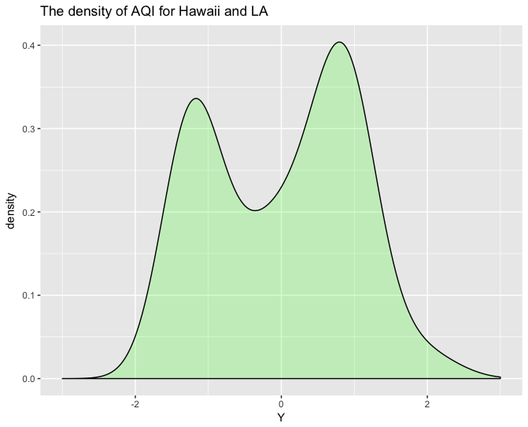
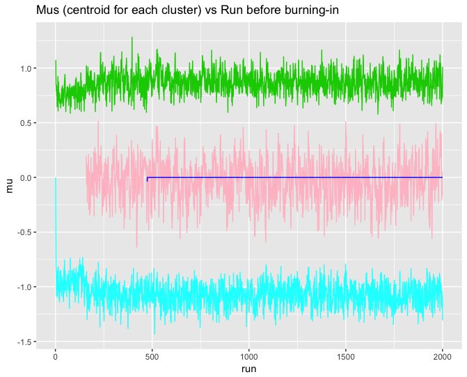
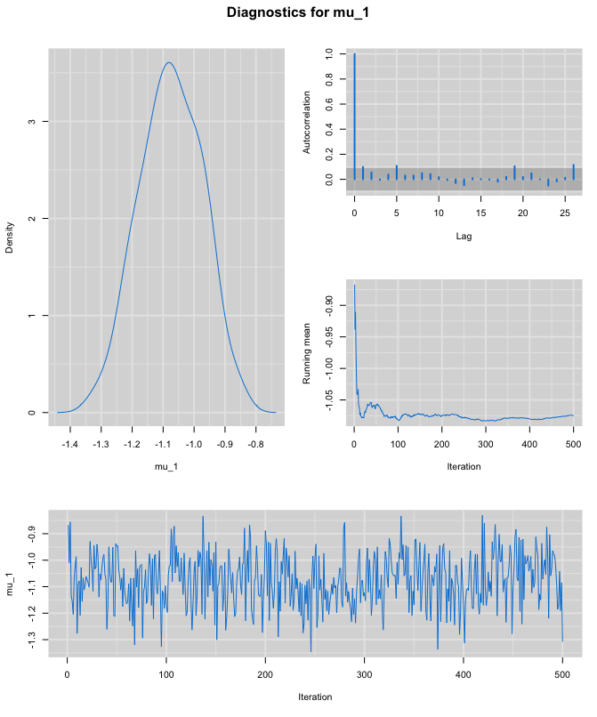
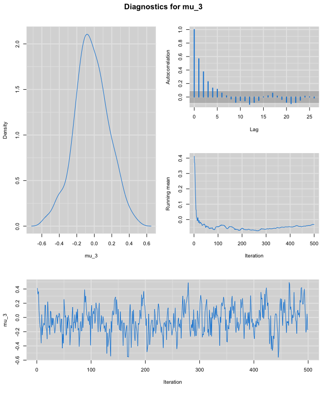

# Introduction  

Clustering is the task of grouping a set of objects in such a way that objects in the same group (called a clusters) are more similar (in some sense) to each other than to those in other groups (clusters). Traditional methods include k-means, hierarchical clustering and many more. In this report, we will discuss a clustering method that employs the non-parametric Bayesian approach. The method does not require the number of clusters as the input, but finds the number of clusters with just the information from the dataset. Our emphasis lies on realization of the Dirichlet process gaussian mixture model.  

Traditional clustering methods compare the distance between data: k-means clustering iteratively computes the distance between each datum and every cluster center in the current state and assigns each datum to the cluster; hierarchical clustering computes the distance between every pair of two data points and data points that are close to each other are assigned to the same cluster. The closer a data point is to a cluster center or another data point, the more likely that the data point belongs to the same cluster with the cluster center or the other data point. If we put it in a Bayesian context, the general idea of the traditional methods is to compare the likelihood that a datum belongs to a certain cluster. Our approach, however, considers another factor that determines which cluster a datum belongs to: the size of clusters. The datum is assigned to the larger cluster with a greater probability.  

We benchmark our clustering method on the one-dimension air quality data from the U.S. Environmental Protection Agency (https://www.epa.gov/outdoor-air-quality-data/download-daily-data). The data records the air quality index of Hawaii and Los Angeles in 2017. We remove the label for two cities and mix the data together. Our task is to cluster the AQI. We would expect there are two clusters as there are two different regions. _Figure 1_ is the density plot for the data after normalization.   

_Figure 1_: The density plot for the AQI of two regions. We can see clearly there are two or more centers of this dataset. Our goal is to use Bayesian method of clustering to find the distribution of parameter of each cluster's centroid.  

```{r, out.width = "150px", echo=FALSE}

```


# Methods

We have $N$ observations $X_1,\dots,X_N$, and for each $X_i$, we have following assumption with fixed $\sigma^2$.

$$
X_i \sim \mathcal{N}(\mu_i,\sigma^2)
$$

We consider $X_i$ and $X_j$ should be in one cluster, if $\mu_i=\mu_j$. We want to propose a prior $\mathcal{H}$ for $\mu$. If $\mathcal{H}$ is a continuous distribution, we have $Pr(\mu_i=\mu_j) = 0$, which is infeasible for clustering. Therefore, we introduce a discrete approximation for our prior by using Dirichlet Process(DP).

## Dirichlet Process (DP)

We have a measure space $(\Theta, \Sigma)$. Define a measurable finite partitioning of $\Theta$ to be a finite collection of sets $A_1,A_2, \dots,A_K$ such that:

(1) Finite: $K<\infty$. (2) Measureable: $A_k \in \Sigma$. (3) Disjoint: $A_j \cap A_k = \emptyset, \forall j \neq k$. (4) Complete: $\cup_kA_k=\Theta$.

A Dirichlet process is a random probability measure $G$ over a $(\Theta, \Sigma)$ with property that given any measurable finite partitioning of $\Theta$, we have

$$
[G(A_1),\dots ,G(A_K)] \sim Dirichlet (\alpha H(A_1),\dots , \alpha H(A_K))
$$

where $\alpha$ is scale, and $H$ is base measure, and $G \sim DP(\alpha, H)$ will be discrete. [1]

## Dirichlet Process Gaussian Mixture Model (DPGMM)

With introduction of DP, we can reformulate our model as following with given $\sigma^2,\alpha,\mu_0,\sigma_0^2$.

$$
\begin{split}
X_i & \sim \mathcal{N}(\mu_i,\sigma^2)\\
\mu_i|G &\sim G\\
G &\sim DP(\alpha, \mathcal{N}(\mu_0,\sigma_0^2)) \\
\end{split}
$$

### Notation

We slice space of $\mu$ into $K$ partitions, and use $Z_i$ to indicate which partition $\mu_i$ falls in, which is our cluster assignment for $X_i$.

$$
\begin{split}
Z_i &= k  \Leftrightarrow \mu_i \; in \; kth \; partition \quad where\; k \in [1,2,\dots,K] \\
p_k &\triangleq P(Z_j=k) \quad \forall j \in[1,2,\dots,N]\\
p  &\triangleq \{ p_1,\dots,p_K\},\quad -i  \triangleq \{1,2,\dots,i-1,i+1,\dots,N\}\\
n_{k,-i}&= count\; of \; j \quad s.t. \;Z_j=k\;and \;j\neq i\\
\end{split}
$$

If we have infinite partitions $K \rightarrow \infty$, we can rewrite our DPGMM model as following:

$$
\begin{split}
X_i| \mu &\sim  \mathcal{N}(\mu_i,\sigma^2)\\
Z_i|p &\sim Discrete(p_1,\dots,p_K) \\
\mu_i & \sim \mathcal{N}(\mu_0,\sigma_0^2)\\
p &\sim Dir(\alpha/K,\dots,\alpha/K) \\
\end{split}
$$

### Predictive Distribution

We have following predictive distribution for $Z_i$, and detail of result derivation is discussed in appendix B.

$$
\begin{split}
P(Z_i=m|Z_{-i}) & = \frac{P(Z_i = m, Z_{-i})}{P(Z_{-i})} \\
& = \frac{\int_{p}P(Z_i = m, Z_{-i}|p_1, \dots ,p_K) P (p_1, \dots ,p_K)dp}
    {\int_{p}P(Z_{-i}|p_1, \dots ,p_K) P (p_1, \dots ,p_K) d p}  \quad\quad\quad\quad\quad   [B.1]\\
& = \frac{\frac{\alpha}{K}+n_{m,-i}}{\alpha+N-1}\\
\end{split}
$$

### Chinese Restaurant Process (CRP)

Based on pervious predictive distribution, when $K \rightarrow \infty$, we have Chinese restaurant process.

$$
\begin{split}
P(Z_i=m|Z_{-i}) & = \frac{n_{m,-i}}{\alpha+N-1}   \quad existing\; cluster \; m\\
P(Z_i=new|Z_{-i}) & = \frac{\alpha}{\alpha+N-1}   \quad new \; cluster\\
\end{split}
$$

## Gibbs Sampler for DPGMM

Based on exchangeability, we have following predictive probability for Gibbis sampling [2] [3] [4]. Detail of derivation for new cluster case is discussed in appendix B.

$$
\begin{split}
&P(Z_i =m |Z_{-i},X) 
\propto P(Z_i=m|Z_{-i},\alpha) \cdot P(X_i| Z_i=m, \mu_i)\\ \\
\propto& \left\{
        \begin{array}{ll}
          n_{m,-i}\cdot \mathcal{N}(x_i; \mu_{[m]}, \sigma^2)
& existing \; cluster\;m\\
        \alpha \int_{\mu} Pr(X_i|\mu) \cdot Pr(\mu|\mu_0) = \alpha \mathcal{N}(x_i; \mu_0, \sigma^2+\sigma^2_0)
& new \; cluster \\
        \end{array}
   \right.  \quad\quad\quad\quad\quad   [B.2]\\ 
& where \quad \mu_{[m]} = \mu \; of \;cluster \;m
\end{split}
$$

## Sampling Algorithm

### Initialization

Assign all data in one cluster s.t. $Z_1^{(0)}=Z_2^{(0)}=\dots=Z_n^{(0)}=1$, and $K^{(0)}=1$. Sample $\mu_{[1]}^{(0)}$  based on posterior of $\mu|X,Z$ ([A.3]), where $n_l$ is count for all $Z_l = j$, detail discussed in appendix B.

### Run detail

For $i \quad in \quad[1,\dots,N]$ sample $Z_i^{(t+1)}$ based on 

$$
\begin{split}
P(Z_i^{(t+1)} = m) 
\propto& \left\{
        \begin{array}{ll}
          n_{m,-i}^{(t)}\cdot \mathcal{N}(x_i; \mu_{[m]}^{(t)}, \sigma^2)
& existing \; cluster\;m\\
        \alpha \mathcal{N}(x_i; \mu_0, \sigma^2+\sigma^2_0)
& new \; cluster \quad s.t. \quad m=K+1\\
        \end{array}
   \right.   \quad\quad\quad\quad\quad   \\
\end{split}
$$

$K=K+1$ each time if our sampled assignment is new. After sampling assignment, we sample $\mu_{[k]}^{(t+1)}$ for all $k \in [1,\dots,K]$ based on 

$$
P(\mu_{[k]}^{(t+1)}|X_l,\; where \; Z_l^{(t+1)}=k) \sim \mathcal{N}( \frac{\frac{\sum x_{l}}{\sigma^2}+\frac{\mu_0}{\sigma_0^2}}{\frac{n_k^{(t+1)}}{\sigma^2}+\frac{1}{\sigma_0^2}}, [\frac{n_k^{(t+1)}}{\sigma^2}+\frac{1}{\sigma_0^2}]^{-1})  \quad\quad\quad\quad\quad   [B.3]
$$  

# Result  

After enough runs, we get the parameter distribution for three different clusters.  
From _Figure 2_, we can see that we got three clusters, and _Table 1_ is some summaries for each cluster.  

_Figure 2_: From the plot we can see that we start from one cluster (blue) and after few runs, second cluster (green) are generated. These two are main cluster for our data, which has mean around -1 and 1. Then, the third cluster is generated after few hundred runs (pink). The blue one is a failed cluster, which means no points is assigned to it when it generated and we exclued it in our following summary and plots.  

```{r, out.width = "150px", echo=FALSE}

```


_Table 1_: result summary:  

| Cluster |Mean|credible intervals| Number of points in this cluster
| ------------- |:-----:|:-------------:| -----:|-----:|
| 1       |-1.075| [-1.27 -0.881 ] | 31 |
| 2       |0.871| [0.687 1.08] | 40 |
| 3       |-0.032| [-0.426  0.353 ] | 14 |

Also we run some test to test convergence of our sample, the plots can be found in Appendix B.4.  

# Discussion  

The first to cluster is just as we expected, the mean is around -1 and 1 just as we see in _Figure 1_. The third cluster is for make up the thin mass around zero. Overall we are satified with our result.  

In this practice, we found that DPGMM is a powerful tool for clustering. It has the ability to model the parameters for each clusters and give us an easy way to illustrate the result. But it also has some drawbacks. For example, with gibbs sampler, we need to sample the parameters and cluster assignments for each points in each run, this process need huge computing power and the speed is obviously slower than other traditional clustering method.  

For the future work, we can add variance as a parameter into our bayesian model and use different prior different than conjugate prior. This may need to use M-H sampler and more time to run, but the result could reach higher accuracy than ours.  


# Reference

[1] Ferguson. (1973). "A Bayesian Analysis of Some Nonparametric Problems" Annals of Statistics

[2] David M. Blei, Michael I. Jordan. (2006). "Variational Inference for Dirichlet Process Mixtures" Bayesian Analysis

[3] Radford M. Neal. (2000). "Markov Chain Sampling Methods for Dirichlet Process Mixture Models" Journal of Computational and Graphical Statistics

[4] Samuel Harris. (2015) " Dirichlet Process Gaussian Mixture Model Gibbs Sampler for a 1-dimensional Behavioural Time Series Segmentation"


# Appendix A  
```{r eval=FALSE}
# reference: [4]
set.seed(1234)
R = 2000 # Number of Gibbs iterations
tenit = R/10 # To be used later for the last 10% of the Gibbs iterations

library(ggplot2)
test1 <- read.csv("~/Documents/OneDrive/MATH640/test1.csv", sep="")
Y = test1$DAILY_AQI_VALUE
plot(density(Y))
empty_k = 0
Y = scale(Y)
N = length(Y)
plot(density(Y))
ggplot()+
  geom_density(aes(Y),fill = "green", alpha = 0.2)+
  xlim(c(-3,3))+
  ggtitle('The density of AQI for Hawaii and LA')

summary(Y)

t = seq(0.1,20,0.1)
#% Now ready to perform Gibbs sampling
#% Prior variance of mu
sigma0 = .15
#% Prior Dirichlet concentration of indicator probability p
c = 1e-3# % 1e-4 for Test 12
#% Likelihood variance of mu
sigma = 0.3
#% Initialization of the variables discussed
Kr = rep(1,R)
Kr2 = rep(1,R)
xr = matrix(rep(1,R*N),nrow=R)
mur = matrix(nrow=R,ncol=N)
nr = matrix(nrow=R,ncol=N)
mur[1,1] = 0
for(r in 1:(R-1)){
  x = xr[r,]
  K = Kr[r]
  mu = mur[r,1:K]
  for(n in 1:N){
    pxy = rep(1,K+1)
    for(k in 1:K){
      i = (x==k)
      Nkni = sum(i)
      if(x[n]==k){
        Nkni = Nkni - 1
      }
    pxy[k] = Nkni*dnorm(Y[n],mu[k],sigma)
    }
  pxy[K+1] = c*dnorm(Y[n],0,sigma0+sigma)
  pxy = pxy/sum(pxy)
  
  x[n] = sample(K+1,1,prob = pxy)
  
  if(x[n]>K){
    K=K+1
    muhat = sigma0*Y[n]/(sigma+sigma0)
    sigmahat = sigma*sigma0/(sigma+sigma0)
    mu[K]=sqrt(sigmahat)*rnorm(1)+muhat
    }
  }
  
  
  Kr2[r] = K
  for(k in 1:K){
    i = (x==k)
    nr[r,k] = sum(i)
    if(sum(i)==0){
      Kr2[r] = Kr[r]-1
      mu[k] = 0
    }
    else{
    
    
    muhat = sigma0*sum(Y[i])/(sigma+sigma0*sum(i))
    sigmahat = sigma*sigma0/(sigma+sigma0*sum(i))
    mu[k] = sqrt(sigmahat)*rnorm(1)+muhat}
  }
  
  
  xr[r+1,]=x
  Kr[r+1]= K
  mur[r+1,1:K] = mu
  
  xrp = xr[(R-tenit):R,]
  murp = mur[(R-tenit):R,]
  
  xmode = mode(xrp)
  mumean = mean(murp)
}


x = 1:2000
dmur=cbind(x,mur)
colnames(dmur)[2:5] = c('mu_1','mu_2','mu_3','mu_4')

ggplot(data.frame(dmur))+
  geom_line(aes(x,mu_1),col=5)+
  geom_line(aes(x,mu_2),col=3)+
  geom_line(aes(x,mu_3),col='pink')+
  geom_line(aes(x,mu_4),col=4)+
  ylab('mu')+
  xlab('run')+
  ggtitle('Mus (centroid for each cluster) vs Run before burning-in')
  
ggplot() + 
  geom_point(aes(x,Kr2))+
  ggtitle('Kr2')


dnr=cbind(x,nr)
colnames(dnr)[2:5] = c('nr_1','nr_2','nr_3','nr_4')

ggplot(data.frame(dnr))+
  geom_line(aes(x,nr_1),col=5)+
  geom_line(aes(x,nr_2),col=3)+
  geom_line(aes(x,nr_3),col='pink')+
  geom_line(aes(x,nr_4),col=4)+
  ylab('number of points in each cluster')+
  xlab('run')+
  ggtitle('number of points in each cluster vs Run')


mean(tail(mur[!is.na(mur[,1]),1],500))
mean(tail(nr[!is.na(nr[,1]),1],500))
mean(tail(mur[!is.na(mur[,2]),2],500))
mean(tail(nr[!is.na(nr[,2]),2],500))
mean(tail(mur[!is.na(mur[,3]),3],500))
mean(tail(nr[!is.na(nr[,3]),3],500))

set.seed(416)
y_sample = c(rnorm(31, -1.07,0.3), rnorm(40,0.867,0.3), rnorm(14,-0.05,0.3))

density(rnorm(31, -1.07,0.3))+density(rnorm(40,0.867,0.3))
ggplot()+
  geom_density(aes(y_sample),fill = "green", alpha = 0.2)+
  geom_density(aes(Y),fill = "red", alpha = 0.2)+
  xlim(c(-3,4))+
  ggtitle('The density of mu and data')

plot(Kr2)

library(mcmcplots)
mmur1 = matrix(tail(mur[,1],500))
mmur2 = matrix(tail(mur[,2],500))
mmur3 = matrix(tail(mur[,3],500))
mmur4 = matrix(tail(mur[,4],500))
colnames(mmur1) = 'mu_1'
colnames(mmur2) = 'mu_2'
colnames(mmur3) = 'mu_3'
colnames(mmur4) = 'mu_4'

mcmcplot1(mmur1)
mcmcplot1(mmur2)
mcmcplot1(mmur3)
```


# Appendix B

## B.1
$$
\begin{split}
P(Z_i=m|Z_{-i}) & = \frac{P(Z_i = m, Z_{-i})}{P(Z_{-i})} \\
& = \frac{\int_{p}P(Z_i = m, Z_{-i}|p_1, \dots ,p_K) P (p_1, \dots ,p_K)dp}
    {\int_{p}P(Z_{-i}|p_1, \dots ,p_K) P (p_1, \dots ,p_K) d p}  \\
\end{split}
$$

$$
P(Z_i = m, Z_{-i}|p_1, \dots ,p_K)= p_m^{n_{m,-i}+1} \prod_{k=1,k \neq m}^{K} p_k^{n_{k,-i}}
$$

### Numerator

Therefore, we can write our numerator of the predictive distribution into the following form,

$$
\begin{split}
numerator
& = \int_{p}P(Z_i = m, Z_{-i}|p_1, \dots ,p_K) P (p_1, \dots ,p_K)d p\\
& = \int_{p} [p_m^{n_{m,-i}+1} \prod_{k=1,k \neq m}^{K} p_k^{n_{k,-i}}] \frac{\Gamma(\sum_{k=1}^{K}\frac{\alpha}{K})}{\prod_{k=1}^{K}\Gamma(\frac{\alpha}{K})}\prod_{k=1}^{K}p_k^{\frac{\alpha}{K}-1}d p \\
& = \frac{\Gamma(\sum_{k=1}^{K}\frac{\alpha}{K})}{\prod_{k=1}^{K}\Gamma(\frac{\alpha}{K})}\int_{p} [p_m^{\frac{\alpha}{K}+n_{m,-i}+1-1} \prod_{k=1,k \neq m}^{K} p_k^{\frac{\alpha}{K}+n_{k,-i}-1}] d p\\
& = \frac{\Gamma(\sum_{k=1}^{K}\frac{\alpha}{K})}{\prod_{k=1}^{K}\Gamma(\frac{\alpha}{K})}
\frac{\Gamma(\frac{\alpha}{K}+n_{m,-i}+1-1) \cdot \prod_{k=1}^{K}\Gamma(\frac{\alpha}{K}+n_{k,-i})}
{\Gamma(\frac{\alpha}{K}+n_{m,-i}+1+\sum_{k=1,k \neq m}^{K}(\frac{\alpha}{K}+n_{k,-i}))} \cdot
\end{split}
$$

where $[p_m^{\frac{\alpha}{K}+n_{m,-i}+1-1}   \prod_{k=1,k \neq m}^{K}p_k^{\frac{\alpha}{K}+n_{k,-i}-1}]$ is the kernel of $Dir(\frac{\alpha}{K}+n_{1,-i},\dots,\frac{\alpha}{K}+n_{m,-i}+1 ,\dots,\frac{\alpha}{K}+n_{K,-i})$.

### Denominator

$$
\begin{split}
denominator
& = \int_{p}P(Z_{-i}|p_1, \dots ,p_K) P (p_1, \dots ,p_K)d p\\
& = \int_{p} [ \prod_{k=1}^{K} p_k^{n_{k,-i}}] \frac{\Gamma(\sum_{k=1}^{K}\frac{\alpha}{K})}{\prod_{k=1}^{K}\Gamma(\frac{\alpha}{K})}\prod_{k=1}^{K}p_k^{\frac{\alpha}{K}-1}d p\\
& = \frac{\Gamma(\sum_{k=1}^{K}\frac{\alpha}{K})}{\prod_{k=1}^{K}\Gamma(\frac{\alpha}{K})}
\int_{p}  \prod_{k=1}^{K}p_k^{\frac{\alpha}{K}+n_{k,-i}-1}dp \\
& = \frac{\Gamma(\sum_{k=1}^{K}\frac{\alpha}{K})}{\prod_{k=1}^{K}\Gamma(\frac{\alpha}{K})}
\frac{\prod_{k=1}^{K}\Gamma(\frac{\alpha}{K}+n_{k,-i})}
{\Gamma(\sum_{k=1}^{K}(\frac{\alpha}{K}+n_{k,-i}))}
\int_{p} 
\frac{\Gamma(\sum_{k=1}^{K}(\frac{\alpha}{K}+n_{k,-i}))}
{\prod_{k=1}^{K}\Gamma(\frac{\alpha}{K}+n_{k,-i})} 
\prod_{k=1}^{K}p_k^{\frac{\alpha}{K}+n_{k,-i}-1}d p \\
\end{split}
$$

We recognize Dirichlet kernel $Dir(\frac{\alpha}{K}+n_{1,-i},\dots, \frac{\alpha}{K}+n_{K,-i})$

$$
denominator =\frac{\Gamma(\sum_{k=1}^{K}\frac{\alpha}{K})}{\prod_{k=1}^{K}\Gamma(\frac{\alpha}{K})}
\frac{\prod_{k=1}^{K}\Gamma(\frac{\alpha}{K}+n_{k,-i})}
{\Gamma(\sum_{k=1}^{K}(\frac{\alpha}{K}+n_{k,-i}))}
$$

### Predictive Distribution

$$
\begin{split}
P(Z_i=m|Z_{-i}) & = \frac{numerator}{denominator} \\
& = \frac{\frac{\Gamma(\sum_{k=1}^{K}\frac{\alpha}{K})}{\prod_{k=1}^{K}\Gamma(\frac{\alpha}{K})}
\frac{\Gamma(\frac{\alpha}{K}+n_{m,-i}+1) \cdot \prod_{k=1}^{K}\Gamma(\frac{\alpha}{K}+n_{k,-i})}
{\Gamma(\frac{\alpha}{K}+n_{m,-i}+1+\sum_{k=1,k \neq m}^{K}(\frac{\alpha}{K}+n_{k,-i}))}}
{\frac{\Gamma(\sum_{k=1}^{K}\frac{\alpha}{K})}{\prod_{k=1}^{K}\Gamma(\frac{\alpha}{K})}
\frac{\prod_{k=1}^{K}\Gamma(\frac{\alpha}{K}+n_{k,-i})}
{\Gamma(\sum_{k=1}^{K}(\frac{\alpha}{K}+n_{k,-i}))}} \\
& = \frac{
\Gamma(\frac{\alpha}{K}+n_{m,-i}+1) \cdot \prod_{k=1}^{K}\Gamma(\frac{\alpha}{K}+n_{k,-i}) \cdot
\Gamma(\sum_{k=1}^{K}(\frac{\alpha}{K}+n_{k,-i}))
}{\prod_{k=1}^{K}\Gamma(\frac{\alpha}{K}+n_{k,-i}) \cdot 
\Gamma(\frac{\alpha}{K}+n_{m,-i}+1+\sum_{k=1,k \neq m}^{K}(\frac{\alpha}{K}+n_{k,-i}))
}\\
& = \frac{
\Gamma(\frac{\alpha}{K}+n_{m,-i}+1)  \cdot
\Gamma(\sum_{k=1}^{K}(\frac{\alpha}{K}+n_{k,-i}))
}{\Gamma(\frac{\alpha}{K}+n_{m,-i})
\Gamma(1+\sum_{k=1}^{K}(\frac{\alpha}{K}+n_{k,-i}))
} \\ 
& = \frac{\frac{\alpha}{K}+n_{m,-i}}{\sum_{k=1}^{K}(\frac{\alpha}{K}+n_{k,-i})} 
 = \frac{\frac{\alpha}{K}+n_{m,-i}}{\sum_{k=1}^{K}\frac{\alpha}{K}+\sum_{k=1}^{K}n_{k,-i}} \\
& = \frac{\frac{\alpha}{K}+n_{m,-i}}{\alpha+n-1} \\
\end{split}
$$

## B.2

Given $X_i \sim \mathcal{N}(\mu_i,\sigma^2)$, and $\mu_i \sim \mathcal{N}(\mu_0,\sigma_0^2)$ 

$$
\begin{split}
P(X_i| Z_i=new, \mu_i) &= \int_{\mu_i} Pr(X_i|\mu_i) \cdot Pr(\mu_i|\mu_0)d\mu_i \\
&\propto \int_{\mu_i} exp[-\frac{1}{2\sigma^2}(x_i-\mu_i)^2] exp[-\frac{1}{2\sigma_0^2}(\mu_i-\mu_0)^2] d\mu_i \\
& = \int_{\mu_i} exp[-\frac{1}{2}(\frac{1}{\sigma_0^2}+\frac{1}{\sigma^2})(\mu_i-\frac{\frac{\mu_0}{\sigma_0^2}+\frac{x_i}{\sigma^2}}{\frac{1}{\sigma_0^2}+\frac{1}{\sigma^2}})^2] d\mu_i \cdot
exp[-\frac{1}{2}(\frac{1}{\sigma_0^2}+\frac{1}{\sigma^2})(\frac{\frac{\mu_0^2}{\sigma_0^2}+\frac{x_i^2}{\sigma^2}}{\frac{1}{\sigma_0^2}+\frac{1}{\sigma^2}} -
\{ \frac{\frac{\mu_0}{\sigma_0^2}+\frac{x_i}{\sigma^2}}{\frac{1}{\sigma_0^2}+\frac{1}{\sigma^2}} \}^2)] 
\end{split}
$$

We recognize normal kernel $\mathcal{N}(\frac{\frac{\mu_0}{\sigma_0^2}+\frac{x_i}{\sigma^2}}{\frac{1}{\sigma_0^2}+\frac{1}{\sigma^2}},(\frac{1}{\sigma_0^2}+\frac{1}{\sigma^2})^{-1})$

$$
\begin{split}
P(X_i| Z_i=new, \mu_i) 
&\propto exp[-\frac{1}{2}(\frac{1}{\sigma_0^2}+\frac{1}{\sigma^2})(\frac{\frac{\mu_0^2}{\sigma_0^2}+\frac{x_i^2}{\sigma^2}}{\frac{1}{\sigma_0^2}+\frac{1}{\sigma^2}} -
\{ \frac{\frac{\mu_0}{\sigma_0^2}+\frac{x_i}{\sigma^2}}{\frac{1}{\sigma_0^2}+\frac{1}{\sigma^2}} \}^2] \\
&= exp[-\frac{1}{2}(\frac{1}{\sigma_0^2}+\frac{1}{\sigma^2})^{-1} ((\frac{\mu_0^2}{\sigma_0^2}+\frac{x_i^2}{\sigma^2})(\frac{1}{\sigma_0^2}+\frac{1}{\sigma^2}) -
(\frac{\mu_0}{\sigma_0^2}+\frac{x_i}{\sigma^2})^2)] \\
&\propto exp[-\frac{1}{2}(\frac{1}{\sigma_0^2}+\frac{1}{\sigma^2})^{-1} (\frac{x_i^2}{\sigma^2 \sigma_0^2} -
2\frac{x_i\mu_0}{\sigma^2\sigma_0^2})] \\
& = exp[-\frac{1}{2}(\frac{\sigma^2 \sigma_0^2}{\sigma_0^2}+\frac{\sigma^2 \sigma_0^2}{\sigma^2})^{-1} (x_i^2 -
2x_i\mu_0)] \\
& \propto exp[-\frac{1}{2}\frac{1}{\sigma_0^2+\sigma^2} (x_i -\mu_0)^2] \\
& \sim \mathcal{N}(\mu_0, \sigma^2+\sigma^2_0) \\
\end{split}
$$

## B.3

### Likelihood
$$
L(X_l|\mu_{[k]}) \propto \prod exp(\frac{1}{2\sigma^2}(x_l-\mu_{[k]})^2) = exp(\frac{1}{2\sigma^2}\sum (x_l-\mu_{[k]})^2)
$$

### Prior
$$
\pi(\mu_{[k]}|\mu_0,\sigma_0^2) \propto exp(\frac{1}{2\sigma_0^2} (\mu_{[k]}-\mu_0)^2)
$$

### Posterior
$$
\begin{split}
P(\mu_{[k]}|X_l,\; where \; Z_l=k) &\propto L(X_l|\mu_{[k]})\pi(\mu_{[k]}|\mu_0,\sigma_0^2) \\
&= exp(\frac{1}{2\sigma^2}\sum (x_l-\mu_{[k]})^2) exp(\frac{1}{2\sigma_0^2} (\mu_{[k]}-\mu_0)^2) \\
& \propto exp[-\frac{1}{2}(\frac{1}{\sigma_0^2}+\frac{n_k}{\sigma^2})(\mu_{[k]}-\frac{\frac{\mu_0}{\sigma_0^2}+\frac{\sum x_l}{\sigma^2}}{\frac{1}{\sigma_0^2}+\frac{n_k}{\sigma^2}})^2] \\
& \sim \mathcal{N}(\frac{\frac{\mu_0}{\sigma_0^2}+\frac{\sum x_l}{\sigma^2}}{\frac{1}{\sigma_0^2}+\frac{n_k}{\sigma^2}}, (\frac{1}{\sigma_0^2}+\frac{n_k}{\sigma^2})^{-1})
\end{split}
$$  

## B.4  
_Figure 3_: The visual test for $\mu_1$.  

```{r, out.width = "250px", echo=FALSE}

```


_Figure 4_:  The visual test for $\mu_2$.  

```{r, out.width = "250px", echo=FALSE}
knitr::include_graphics("p4.png")
```

_Figure 5_:  The visual test for $\mu_3$.  

```{r, out.width = "250px", echo=FALSE}

```